# User Story: ArtCoin - Art Circulation and Discovery

## Scenario: Artist Sharing Artwork Through Venues or directly with art lovers (individuals) Using Nondominium

**Context**: An independent artist wants to circulate their paintings through a network of venues (cafes, restaurants, offices) or directly with individual art lovers, to gain exposure and generate income, using the Artcoin platform built on Nondominium infrastructure. **This scenario primarily demonstrates Nondominium's resource sharing capabilities, with optional extension for a more comprehensive cultural network economics.**

See also *artcoin_main_doc.md* and *nondominium_artcoin.md*.

> **How to read this story.** The artwork is a **Nondominium Object (NDO)**: a permanent
> `NondominiumIdentity` (Layer 0) plus a `ResourceSpecification` (Layer 1) and the
> economic activity around it (Layer 2). Custody moves via `transfer_custody`; every
> interaction generates bilateral **Private Participation Receipts (PPRs)**. Sequence
> diagrams below use real Nondominium zome functions where they exist; some steps are
> Artcoin platform-layer conveniences over those primitives. For the capability-by-capability
> status (what is code-complete vs. planned — e.g. payment settlement), see
> *nondominium_artcoin.md §5*.

---

## 🏗️ System Architecture Context

### **Resource Sharing Focus (Nondominium Sweet Spot)**

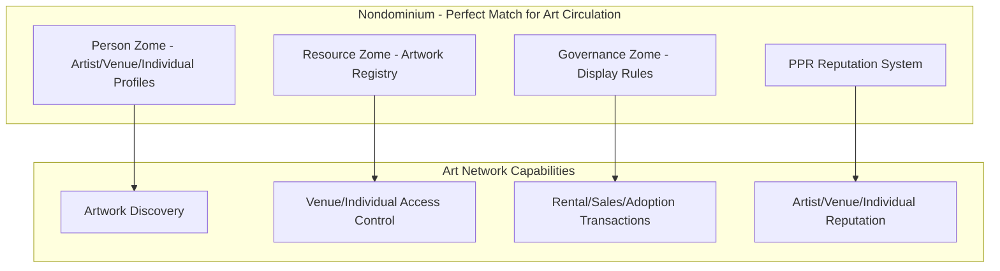

**Why Nondominium Excels for Art Networks**:

- Perfect fit for bilateral resource sharing (artwork ↔ venue/individual)
- PPR system captures artistic and custodial reputation effectively
- Economic events handle rental, sales or adoption transactions cleanly
- Governance rules protect artwork and ensure proper care

### **Optional Enhancement (Cultural Economics Analysis)**

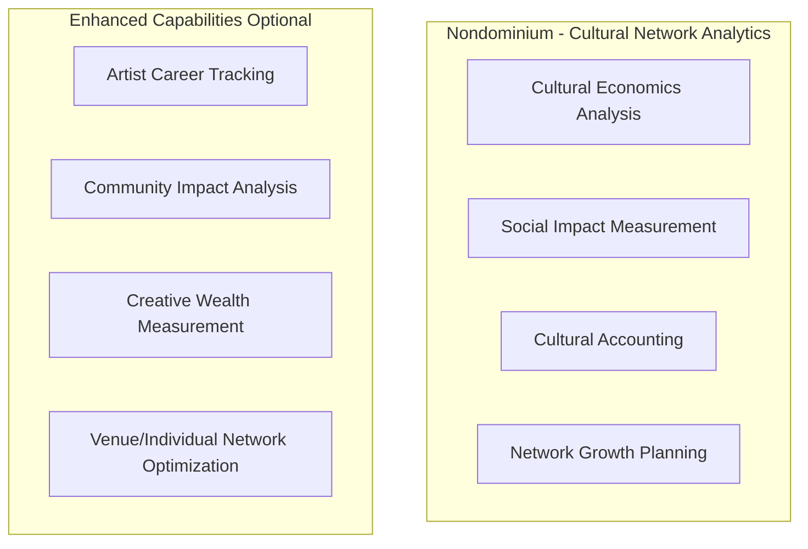

**Enhancement**:

- Cultural value beyond simple sales or rental income — beyond the transactional
- Social impact measurement of public art access
- Artist career development analytics
- Community cultural enrichment metrics

## 🎨 The Players

### **Maya Rodriguez** - Independent Visual Artist

- **Role**: Accountable Agent (Creator & Resource Owner)
- **Goal**: Circulate artwork to gain public recognition and generate sustainable income
- **Reputation**: Emerging artist with growing local following, strong craftsmanship record

### **Jean-Pierre Dubois** - Café Owner

- **Role**: Primary Accountable Agent (Custodian)
- **Goal**: Enhance café ambiance with rotating art while supporting local artists
- **Reputation**: Established venue owner with excellent art care track record

### **Amara Okafor** - Individual Art Lover

- **Role**: Simple → Accountable Agent (Custodian)
- **Goal**: Discover and adopt art encountered in everyday venues, becoming custodian of a piece she loves
- **Reputation**: New to the network; builds custodial reputation through her first adoption

### **Support Agents** - Transporter & Storer

- **Roles**: Accountable Agents holding the validated `Transport` and `Storage` roles
- **Goal**: Move and safely hold artworks between custodians, earning service PPRs
- **Reputation**: Specialized service providers vetted through role validation (`REQ-GOV-04`)

### **The Artwork**

- **Piece**: "Urban Rhythms" - Oil on Canvas, 36" x 48"
- **Current Location**: Maya's Studio, Montreal
- **Governance Rules**: 70% artist commission on sales, $40/month rental fee, smoke-free display required

---

## 🔄 Art Circulation Journey

### **Phase 1: Artwork Creation & Onboarding (Week 1)**

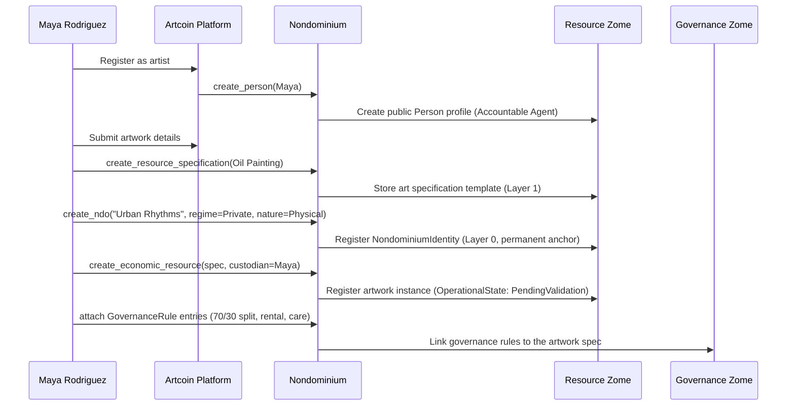

**Artwork Onboarding Process**:

1. **Artist Registration**: Maya creates her artist profile with portfolio and credentials
2. **Resource Specification**: Defines artwork type (Oil on Canvas 2025 collection)
3. **Artwork Registration**: Registers "Urban Rhythms" with:
  - Physical specifications (size, medium, weight)
  - High-resolution images and provenance
  - Governance rules: 70/30 split, $40/month rental, insurance requirements
  - Care instructions and display preferences

### **Phase 2: Venue Discovery & Matching (Week 2)**

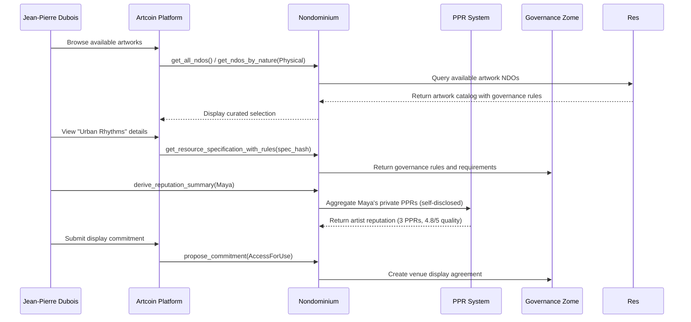

**Venue Discovery Process**:

1. **Artwork Browsing**: Jean-Pierre searches Artcoin platform for café-appropriate artwork
2. **Artist Review**: Evaluates Maya's portfolio and reputation:
  - 3 previous successful venue displays
  - 4.8/5 artwork quality rating
  - Positive venue feedback comments
3. **Governance Review**: Analyzes display terms:
  - $40/month rental fee ✅
  - 70% artist commission on sales ✅
  - Smoke-free environment requirement ✅
  - Quarterly rotation option
4. **Display Commitment**: Jean-Pierre submits AccessForUse commitment for 3-month initial period

### **Phase 3: Validation & Trust Building (Week 3)**

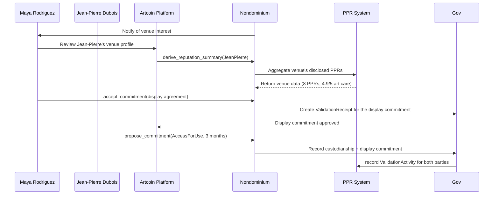

**Mutual Validation Process**:

1. **Venue Vetting**: Maya reviews Jean-Pierre's café reputation:
  - 8 previous art displays completed
  - 4.9/5 artwork care rating
  - No damage incidents in 2 years
  - Active art promotion on social media
2. **Insurance Verification**: Jean-Pierre provides liability insurance certificate
3. **Display Agreement**: Both parties sign smart contract with automated revenue sharing
4. **Trust Confirmation**: PPR system records mutual validation for future partnerships

### **Phase 4: Artwork Preparation & Transport (Week 4)**

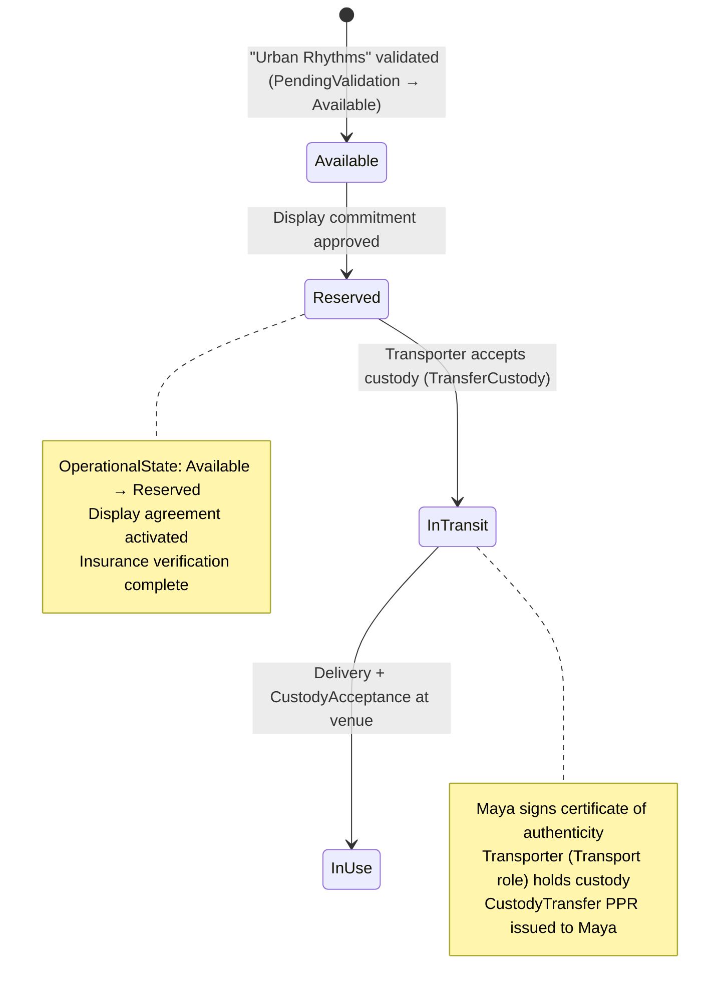

**Transport & Installation**:

1. **Artwork Preparation**: Maya prepares "Urban Rhythms" for transport:
  - Professional packaging and framing
  - Certificate of authenticity signed
  - Installation and care instructions
2. **Transport Coordination**: Verified transport agent arranges delivery
3. **Custody Transfer**: Maya transfers custody to transport agent (CustodyTransfer PPR)
4. **Venue Installation**: Transport agent delivers and installs artwork at café
5. **Acceptance Confirmation**: Jean-Pierre accepts custody (CustodyAcceptance PPR)

### **Phase 5: Public Display & Engagement (Months 1-3)**

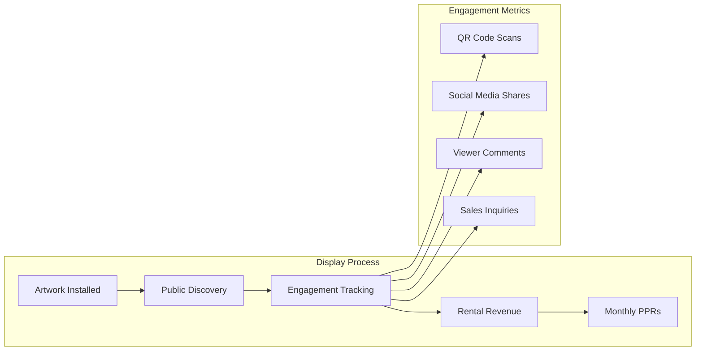

**Public Display Experience**:

1. **Physical Installation**: "Urban Rhythms" prominently displayed in café seating area
2. **Digital Integration**: QR code links to artwork's Nondominium profile showing:
  - Artist biography and artistic statement
  - Previous display history and public engagement
  - Purchase inquiries and rental information
  - Authenticity verification and provenance
3. **Engagement Tracking**: Platform monitors:
  - Daily viewer interactions via QR code scans
  - Social media mentions and shares
  - Sales inquiries and appreciation requests
  - Public comments and ratings
4. **Monthly Revenue**: Automated payment processing with 70/30 revenue split

### **Phase 6: Extended Discovery & Sales Opportunity (Month 2)**

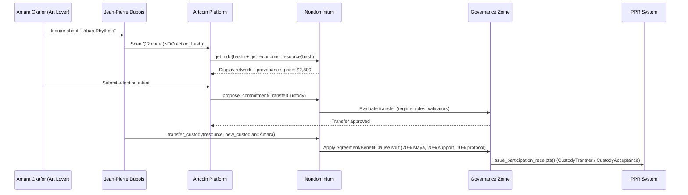

**Adoption Process Integration**:

1. **Discovery**: Amara, an individual art lover, discovers the artwork during a café visit
2. **Authenticity Verification**: The QR code resolves the NDO's permanent Layer 0 `action_hash`, providing verifiable provenance
3. **Governed Transfer**: The governance zome evaluates the custody transfer against the artwork's `PropertyRegime` and `GovernanceRule` entries before it is finalized
4. **Custody Handover**: Custody moves from Jean-Pierre to Amara; she becomes the new Custodian (Simple → Accountable Agent after her first validated transaction)
5. **Receipts**: Both parties receive bilateral PPRs (`CustodyTransfer` / `CustodyAcceptance`); revenue split via `Agreement`/`BenefitClause` is applied where value settlement is enabled (see *nondominium_artcoin.md §5*)

### **Alternative Path: Storage Between Custodians**

Not every display period ends in an adoption. When a rental/display period ends and no
new custodian is immediately ready, the current custodian (e.g. the venue) requests
**storage** rather than returning the piece to the artist:

1. A **Storer** (Accountable Agent with the validated `Storage` role) commits to hold
   the piece until a new agent wants to buy, rent, or adopt it — `StorageCommitmentAccepted` PPR
2. Custody transfers from the venue to the storer (`transfer_custody`); the artwork
   moves to `OperationalState::InStorage` — `CustodyTransfer` / `CustodyAcceptance` PPRs
3. When a new custodian appears, the storer releases the piece (earning a
   `StorageFulfillmentCompleted` PPR) and the circulation cycle continues

This keeps artworks in safe, accountable custody throughout their circulation, with
every hand-off recorded and reputation-scored.

---

## 📊 Network Effects & Artist Growth

### **Artist Reputation Development**

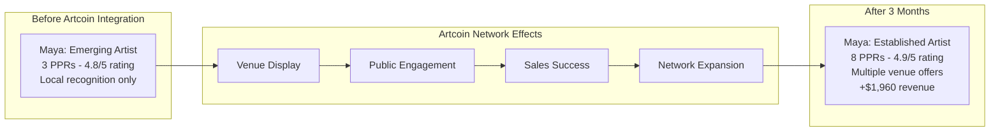

**Maya's PPR Growth** (real `ParticipationClaimType` categories):

- +1 `ResourceCreation` (registering "Urban Rhythms" as an NDO)
- +1 `CustodyTransfer` (handing custody to the transporter for display)
- +1 `CustodyTransfer` (custody handover on adoption/sale)
- +1 `RuleCompliance` (adherence to the artwork's display governance rules)
- +1 `ValidationActivity` (participating in the venue/commitment validation)
- **Reputation Impact**: 4.8 → 4.9 overall rating (derived from PPR `PerformanceMetrics`: timeliness, quality, reliability, communication, overall satisfaction)

### **Venue Benefits Expansion**

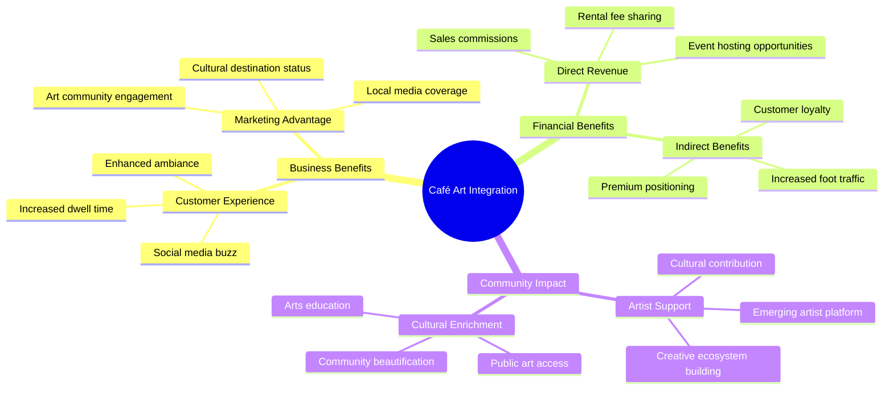

---

## 🌐 Platform Integration Architecture

### **Artcoin Platform Integration**

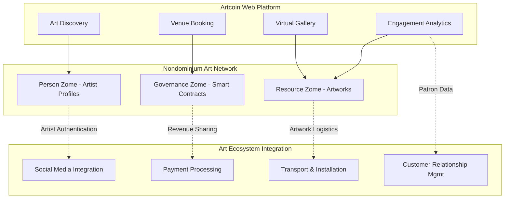

### **Artist-Centric Features**

**Creative Empowerment Tools**:

- **Portfolio Management**: Comprehensive artwork catalog with exhibition history
- **Revenue Analytics**: Real-time tracking of rental income and sales performance
- **Audience Insights**: Data on artwork engagement across different venue types and locations
- **Network Discovery**: Connection with complementary venues and art communities

**Smart Contract Capabilities**:

- **Dynamic Pricing**: Automated pricing adjustments based on artist reputation and demand
- **Royalty Enforcement**: *Droit de suite* compliance for secondary sales
- **Multi-Venue Management**: Simultaneous display across multiple venues
- **Flexibility Options**: Easy modification of governance rules for different artwork collections

---

## 💡 Artistic Innovation Benefits

### **Creative Independence & Sustainability**

- **Direct Artist Income**: Elimination of gallery commissions and intermediaries
- **Artistic Control**: Artists retain ownership and creative direction
- **Sustainable Career**: Ongoing passive income through rental rather than one-time sales
- **Audience Building**: Direct connection with art enthusiasts and collectors

### **Cultural Democratization**

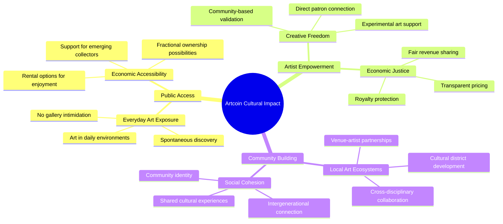

### **Technology-Enhanced Art Experience**

- **Provenance Tracking**: Complete artwork history with blockchain verification
- **Interactive Engagement**: QR codes enabling deeper artist and artwork stories
- **Community Curation**: Decentralized validation of artistic quality and relevance
- **Global Reach**: Local physical display with global digital discovery

---

## 🎯 Strategic Outcomes

### **Immediate Artist Benefits**

- ✅ **Revenue Generation**: $1,960 total ($120 rental + $1,840 sale commission)
- ✅ **Exposure Expansion**: Artwork viewed by ~2,000 café visitors over 2 months
- ✅ **Network Growth**: Invitations from 4 other venues for future displays
- ✅ **Reputation Building**: Enhanced artist profile with verifiable success metrics

### **Long-Term Career Development**

- **Sustainable Practice**: Ongoing rental income providing financial stability
- **Direct Patron Relationships**: Building collector base without gallery intermediation
- **Artistic Freedom**: Ability to experiment with new styles and mediums
- **Community Recognition**: Established as contributor to local cultural ecosystem

### **Platform Evolution**

- **Artist Success Stories**: Growing database of artist career development case studies
- **Venue Network Expansion**: Increasing number of quality venues seeking art partnerships
- **Collector Community**: Developing base of art enthusiasts engaged with platform
- **Cultural Impact Metrics**: Quantifiable data on art accessibility and community enrichment

---

## 🔮 Future Possibilities

### **Extended Art Forms Integration**

- **Digital Art**: NFTs with physical display components
- **Performance Art**: Bookable performances in venue spaces
- **Interactive Installations**: Technology-enhanced artwork experiences
- **Multi-Sensory Art**: Integration with venue's ambiance and customer experience

### **Advanced Economic Models**

- **Artist Cooperatives**: Collective ownership and management of shared studio spaces
- **Patronage Systems**: Community-supported artist funding models
- **Cultural Investment**: Artwork as appreciating community assets
- **Cross-Disciplinary Collaboration**: Joint projects between artists, musicians, and performers

---

**This user story demonstrates how Nondominium enables artists to transform their relationship with the art market, creating sustainable careers through direct community engagement while maintaining creative independence and building verifiable reputations in a decentralized cultural ecosystem.**

---

*Artwork "Urban Rhythms" was adopted by Amara Okafor, an individual art lover, after 2 months of café display — a direct artist-to-individual custody transfer governed entirely by the artwork's embedded rules. Maya now has 3 other artworks circulating across venues and individual custodians, held in safe storage between hand-offs, earning consistent income while building a verifiable, self-sovereign reputation.*